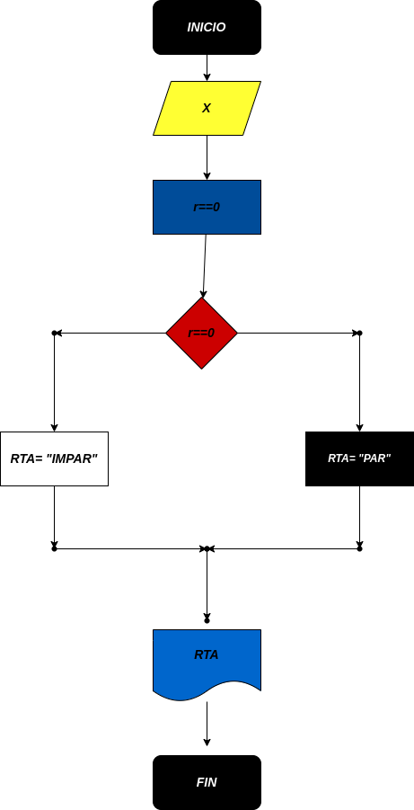

# Ejerccio N.4

## Programa para verificar si un numero es Par o Impar

# ANALISIS

Variabes de entrada (input)

x: Un numero.

Variables de proceso y salida (precessing, storage, output)

MOD= El modulo de X%2.

rta= resultado de la decision.

# DISEÑO

# CONSTRUCCION
